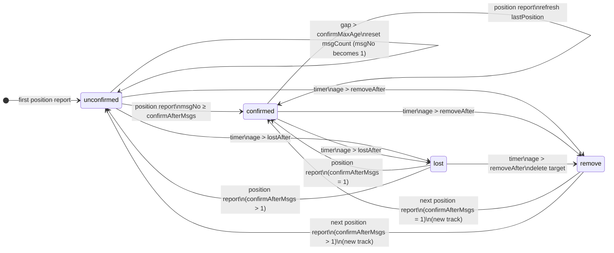

# Signal K AIS Status Plugin
This plugin evaluates AIS target reporting continuity and maintains a per-target tracking state using class-specific timing thresholds. It publishes `sensors.ais.status` deltas to Signal K, enabling consuming applications to assess target validity, reliability, and reporting continuity.

## About
AIS reception is often intermittent (collisions, range, antenna shadowing), so a single position report does not necessarily mean a target is reliably tracked, and an old position may be unsafe to treat as current. The published state (`unconfirmed`, `confirmed`, `lost`, `remove`) lets clients display and filter targets appropriately and avoid “ghost” or stale tracks.

### A Note About Client State Interpretation
Client applications are free to interpret the state, but the basic intended UX is:

- `unconfirmed`: show the target, but de-emphasize it (e.g. faded / dotted / “suspect”). Avoid using it for alarms until it becomes confirmed.
- `confirmed`: show normally and treat as an active track.
- `lost`: keep showing the last known position briefly, but clearly indicate staleness (e.g. greyed out with “age since last update”). Typically suppress CPA/guard-zone style alarms for lost targets.
- `remove`: remove the target from display and lists.

Keeping `unconfirmed` and `lost` targets visible (but styled differently) helps avoid clutter from one-off decodes while still preserving situational awareness when reception is intermittent.

## Plugin AIS Target State Management
The plugin applies standardized timing and continuity rules to manage AIS targets throughout their tracking lifecycle. Targets are created on first reception, transition to a confirmed tracking state after sufficient report continuity, and are marked as lost when expected reports are no longer received. The resulting tracking state is continuously updated and published for use by downstream consumers.

### Sources (input scope)
Subscribes to deltas with the following contexts to determine which entities/updates are tracked:
- vessels
- atons
- shore.basestations
- sar
- aircraft

### Target identity & indexing (stable identity)
The Signal K `context` string is the primary key for in-memory tracking. One item per context. No MMSI indexing or conflict handling is performed by the plugin.

### Position report rules (message quality)
Each `navigation.position` update advances the tracking state and updates `lastPosition`.

### State thresholds by class (reliability tuning)
Class A confirms quickly and times out quickly; Class B confirms slower and times out slower, etc. See [Device Class Processing Definition](#device-class-processing-definition) for class details. 

### Class resolution (source vs fallback)
The plugin prefers `sensors.ais.class` when it is present and one of the supported values. If it is missing or unsupported, the class falls back to the target context. Unsupported values are logged at debug level.

Fallback mapping:
- `atons.*` -> `ATON`
- `shore.basestations.*` -> `BASE`
- `sar.*` -> `SAR`
- `aircraft.*` -> `AIRCRAFT`
- otherwise -> `B`

### State machine (status consistency)
*Prior to the first message, status will not exist.*
- unconfirmed = A position has been received, but the minimum message threshold has not been met.
- confirmed = The minimum number of messages has been received within the `confirmMaxAge` threshold.
- lost = No messages have been received within the `lostAfter` threshold.
- remove = No messages have been received within the `removeAfter` threshold.

If not enough messages are received within `confirmMaxAge`, the confirmation process resets and the target remains `unconfirmed`. Once enough messages are received, status becomes `confirmed`. Targets become `lost` after a period of silence and `remove` after a longer period without position.



**Trigger:** `<context>.navigation.position` received
| Condition | Action |
|---        |---     |
| `msgCount` < `confirmAfterMsgs` | `status` = **'unconfirmed'** <br>`msgCount` -> increment <br>`lastPosition` = `Date.now()` |
| (`msgCount` >= `confirmAfterMsgs`) <= `confirmMaxAge` | `status` = **'confirmed'** <br>`msgCount` -> capped at `confirmAfterMsgs` <br>`lastPosition` = `Date.now()`

If the time gap between unconfirmed messages exceeds `confirmMaxAge`, `msgCount` resets to `0` before the next increment.

**Trigger:** Status Interval Timer Event
| Condition | Action |
|---        |---     |
| `Date.now() - lastPosition` > `lostAfter` | `status` = **'lost'** <br>`msgCount` = 0 <br>`lastPosition` -> unchanged |
| `Date.now() - lastPosition` > `removeAfter` | `status` = **'remove'** <br>`msgCount` = 0 <br>`lastPosition` -> unchanged <br> delete target from map |

### Timing & publication (resource consumption)
The plugin emits Signal K deltas to the target context with:

- Path: `sensors.ais.status`
- Values: `unconfirmed`, `confirmed`, `lost`, `remove`

There are two processes that generate delta updates:
1. Position Update: runs when position is received and applies `unconfirmed` / `confirmed` logic.
2. Status Check: runs on a fixed interval and applies `lostAfter` and `removeAfter` thresholds.

## State Management parameters

### Device Class Processing Definition
``` typescript
const AIS_CLASS_DEFAULTS = {
  A: {
    confirmAfterMsgs: 2,
    confirmMaxAge: 180000,  // ms
    lostAfter: 360000,      // ms
    removeAfter: 540000     // ms
  },
  B: {
    confirmAfterMsgs: 3,
    confirmMaxAge: 180000,  // ms
    lostAfter: 360000,      // ms
    removeAfter: 540000     // ms
  },
  ATON: {
    confirmAfterMsgs: 1,
    confirmMaxAge: 180000,  // ms
    lostAfter: 900000,      // ms
    removeAfter: 3600000    // ms
  },
  BASE: {
    confirmAfterMsgs: 1,
    confirmMaxAge: 10000,   // ms
    lostAfter: 30000,       // ms
    removeAfter: 180000     // ms
  },
  SAR: {
    confirmAfterMsgs: 1,
    confirmMaxAge: 10000,   // ms
    lostAfter: 30000,       // ms
    removeAfter: 180000     // ms
  },
  AIRCRAFT: {
    confirmAfterMsgs: 1,
    confirmMaxAge: 10000,   // ms
    lostAfter: 30000,       // ms
    removeAfter: 180000     // ms
  }
}
```


### Target Selection
``` typescript
const AIS_CONTEXT_PREFIXES = [
  'atons.*',
  'shore.basestations.*',
  'vessels.*',
  'sar.*',
  'aircraft.*'
];
```
